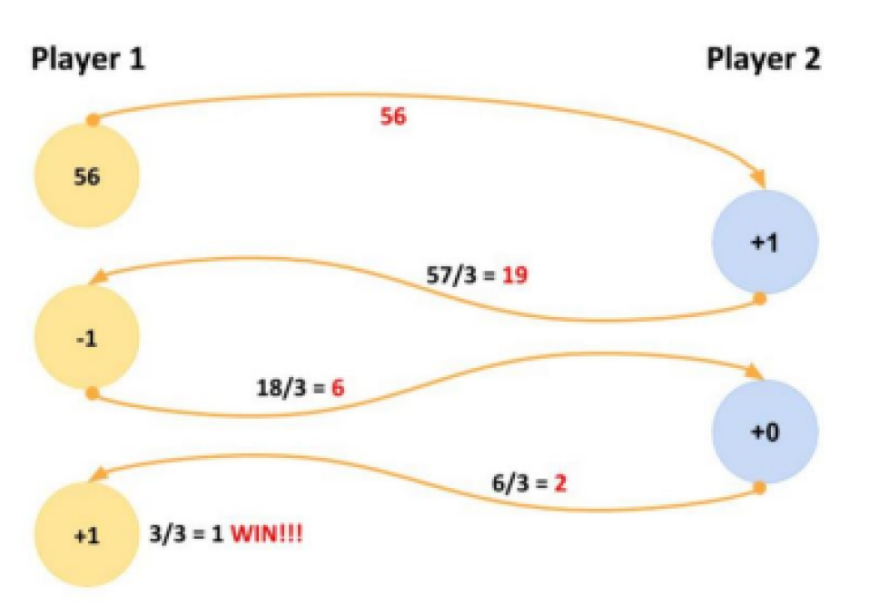
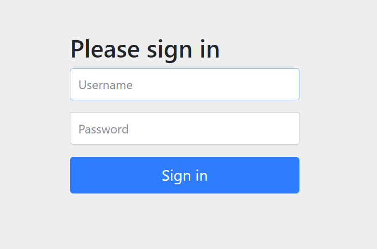
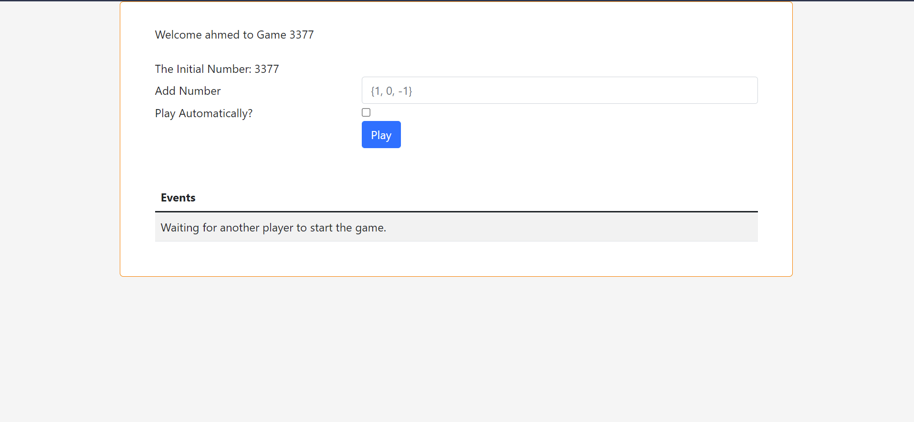
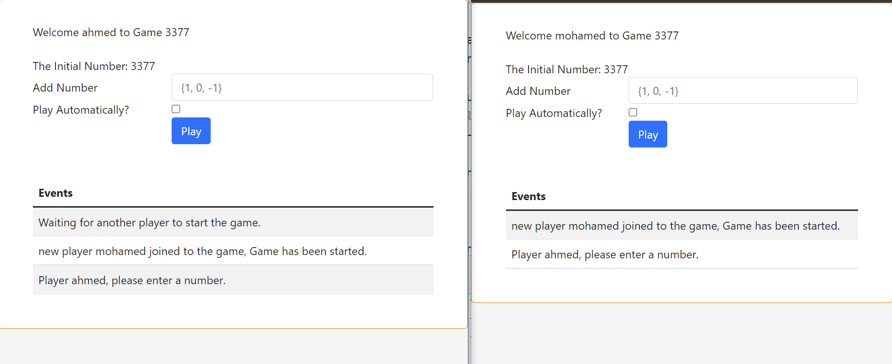
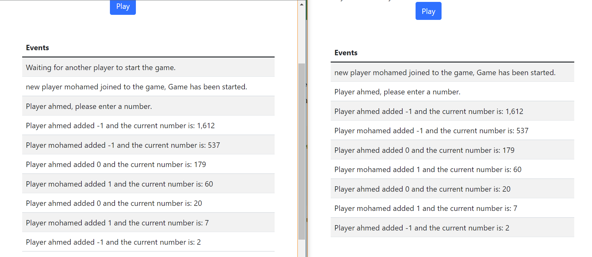

## Game of Three - WebSocket Service

#### Goal

The Goal is to implement a game with two independent units – the players – communicating with each other using a
Websocket.

#### Description

When a player starts, it incepts a random (whole) number and sends it to the second player as an approach to starting
the game. The receiving player can now always choose between adding one of {-1, 0, 1} resulting in a new number. Divide
it by three. The resulting whole number is then sent back to the original sender. The same rules are applied until one
player reaches the number 1 (after the division). See example below.



For each "move", a sufficient output should be generated (mandatory: the added, and the resulting number). Both players
should be able to play automatically without user input. The type of input (manual, automatic) should be optionally
adjustable by the player.

#### Used Technologies

* ##### Back-End
    * **Spring** (boot, websocket, security, and JPA).
    * **H2** in-memory database.
* ##### Front-End
    * **jquery**
    * **Bootstrap**
    * **Stomp** with **SockJS**

#### Requirements

* [JDK 1.8](http://www.oracle.com/technetwork/java/javase/downloads/index.html) or later
* Web Browser supports javascript

#### Installing & running

* you can run the application by using
  ```./mvnw spring-boot:run ```

* Alternatively, you can build the JAR file then run it as follows:
    * ```./mvnw clean package```
    * ```java -jar target/gameofthree-0.0.1-SNAPSHOT.jar```

#### Testing

After the application running, follow the below steps:

1. Open http://localhost:8080, then you will be directed to login page like below:
   
2. Feel free to pick-up one of the below provided users:
    * ```ahmed/123```, ```mohamed/123``` or ```abuelhassan/123```
3. After successful authentication, you will be re-directed to home page like below:
   
4. For playing, another player must join the current game by repeating step 1 and step 2 with different user.
5. Once another player joined the game, an event will be triggered to the first logged-in player to notify him to play
   like below:
   
6. With every play, sufficient output generated:
   

#### Road Map

* Enhancing the game-over mechanism for playing again.
* Creating new module for registration and replacing the current in-memory authentication.
* Applying spring profiles for distinguishing the used configs.
* Increasing the code coverage by adding more unit and integration tests.
* Applying security for websocket communications.
* Applying one of the fully featured STOMP message broker such as RabbitMQ, ActiveMQ, and others for production profile
  for support indexing and so on.
* Dockerizing the service to be easily deployed, scaled and so on.
* Handling multiple open sessions at the same time for the same player.

## Authors

[**Ahmed Abuelhassan**](https://www.linkedin.com/in/aabuelhassan/)